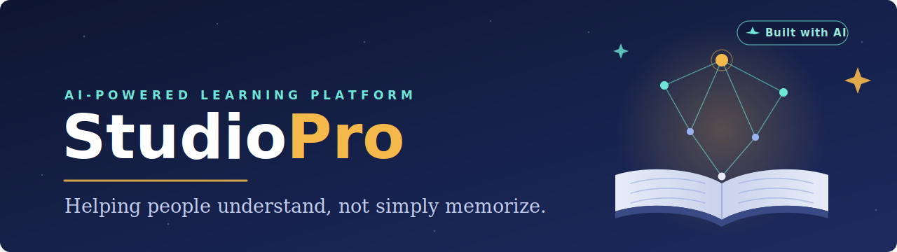

<p align="center">
  
</p>

<p align="center">
  <a href="https://mentorestudio.vercel.app"><b>🚀 Live Demo</b></a> •
  <a href="docs/PROJECT_VISION.md"><b>Vision</b></a> •
  <a href="docs/PRODUCT_ROADMAP.md"><b>Roadmap</b></a> •
  <a href="docs/SYSTEM_ARCHITECTURE.md"><b>Architecture</b></a> •
  <a href="docs/AI_AGENTS.md"><b>AI Agents</b></a>
</p>

<p align="center">


</p>

---

# 🎯 Mission

> **Helping people understand, not simply memorize.**

StudioPro is an AI-powered learning platform designed to help students understand concepts rather than simply obtain answers.

Instead of replacing teachers or textbooks, StudioPro combines artificial intelligence with educational principles to create an intelligent learning environment capable of explaining, organizing, testing and personalizing every study session.

---

# 📖 Overview

StudioPro is an AI-powered learning platform built around a **Multi-Agent AI Architecture**.

Specialized AI agents collaborate to guide students throughout the entire learning process:

- understanding new concepts
- organizing study material
- generating summaries
- creating quizzes
- planning study sessions
- visualizing knowledge

The platform is designed to become a complete AI learning ecosystem where every component works together to improve comprehension rather than memorization.

---

# ✨ Features

## Planned Features

- 📄 Document Upload
- 💬 AI Chat
- 🤖 AI Tutor
- 📝 Automatic Summaries
- ❓ Quiz Generation
- 🧠 Mind Maps
- 📅 Study Planner
- 📚 Study Sessions
- 🤝 Multi-Agent Collaboration

---

# 🏗 System Architecture

StudioPro follows a modular layered architecture.

```text
Frontend
      │
Backend API
      │
AI Orchestrator
      │
Multi-Agent System
      │
Database + Storage
```

The AI Orchestrator coordinates specialized agents while keeping the user experience simple and unified.

Read the complete design in [System Architecture](docs/SYSTEM_ARCHITECTURE.md).

---

# 🤖 AI Agents

The first generation of StudioPro includes five specialized AI agents.

| Agent | Purpose |
|--------|----------|
| 🎓 Tutor Agent | Explain concepts |
| 📄 Summary Agent | Generate summaries |
| ❓ Quiz Agent | Assess knowledge |
| 📅 Planner Agent | Organize study plans |
| 🧠 Mind Map Agent | Visualize relationships |

The architecture has been designed to easily support future agents without modifying the existing system.

Read the complete specification in [AI Agents](docs/AI_AGENTS.md).

---

# 📚 Documentation

The project documentation is organized into dedicated design documents.

| Document | Description | Status |
|----------|-------------|--------|
| [📘 Project Vision](docs/PROJECT_VISION.md) | Product mission and vision | ✅ Complete |
| [🗺 Product Roadmap](docs/PRODUCT_ROADMAP.md) | Development strategy and milestones | ✅ Complete |
| [🏗 System Architecture](docs/SYSTEM_ARCHITECTURE.md) | Overall software architecture | ✅ Complete |
| [🤖 AI Agents](docs/AI_AGENTS.md) | Multi-agent system design | ✅ Complete |
| [🗄 Database Design](docs/DATABASE_DESIGN.md) | Database architecture and schema | ✅ Complete |
| [🔌 API Design](docs/API_DESIGN.md) | REST API specification | ✅ Complete |
| [🎨 Frontend Design](docs/FRONTEND_DESIGN.md) | User interface and UX design | ✅ Complete |

---

# 🛠 Technology Stack

## Current Prototype

The current online prototype uses:

- HTML5
- Tailwind CSS
- Vanilla JavaScript
- Vercel Serverless Functions
- OpenAI APIs
- Anthropic APIs
- Vercel

## Target Architecture (v1.0)

### Frontend

- Next.js
- React
- TypeScript
- Tailwind CSS

### Backend

- Node.js
- Express

### Database

- PostgreSQL

### Storage

- Supabase Storage

### Artificial Intelligence

- OpenAI
- Anthropic
- Local Models *(future)*

---

# 🚀 Development Roadmap

```text
✅ Project Vision
        │
✅ Product Roadmap
        │
✅ System Architecture
        │
✅ AI Agents
        │
✅ Database Design
        │
✅ API Design
        │
✅ Frontend Design
        │
⬜ Backend Development
        │
⬜ Frontend Development
        │
⬜ MVP
        │
⬜ Beta
        │
⬜ Version 1.0
```

---

# 📂 Repository Structure

```text
StudioPro/

docs/
├── assets/
│   └── studiopro-banner.svg
├── PROJECT_VISION.md
├── PRODUCT_ROADMAP.md
├── SYSTEM_ARCHITECTURE.md
├── AI_AGENTS.md
├── DATABASE_DESIGN.md
├── API_DESIGN.md
└── FRONTEND_DESIGN.md

# Current prototype
api/          → Vercel serverless functions
public/       → Static assets

# Future architecture (v1.0 — Next.js)
app/
components/
services/
agents/
database/
styles/
types/
```

---

# ⚡ Getting Started

StudioPro is currently transitioning from the planning phase to active development.

Current prototype:

```bash
git clone https://github.com/Domenico374/studiopro.git

cd studiopro

npx vercel dev
```

Future versions (Next.js):

```bash
npm install

npm run dev
```

> The setup instructions will evolve together with the project architecture.

---

# 🎯 Current Status

## Documentation

- ✅ Project Vision
- ✅ Product Roadmap
- ✅ System Architecture
- ✅ AI Agents
- ✅ Database Design
- ✅ API Design
- ✅ Frontend Design

## Development

- ⏳ Backend Development
- ⏳ Frontend Development
- ⏳ MVP Development

Current Phase:

🟢 **Documentation completed**

🚀 **Development starting**

---

# 🌍 Long-Term Vision

StudioPro aims to become a complete AI-powered learning ecosystem capable of supporting students throughout every stage of their educational journey.

Future evolution includes:

- 📱 Mobile Application
- 🎙 Voice Tutor
- 🌐 Multi-language Support
- 🤝 Collaborative Learning
- 🔌 Plugin System
- 🏫 LMS Integrations
- 🧩 Marketplace
- 📊 Learning Analytics
- 🏢 Enterprise Edition

---

# 🤝 Contributing

StudioPro is currently under active development.

Ideas, feedback and contributions will be welcome as the project evolves.

---

# 📄 License

The project is currently under development.

The license will be defined before the first public release.

---

<p align="center">
<b>⭐ Helping students understand, not simply memorize. ⭐</b>
</p>
